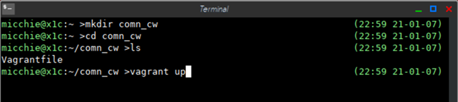
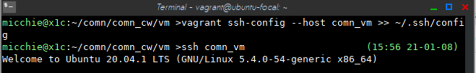

## Virtual machine setup

All the assignment can be done inside the VM created in the following way.

### Why we use a virtual machine

- Courseworks rely on many external apps and libraries
- Installing and configuring them for individual environment are tedious or often impossible
- We want a common platform

### Environment check

- If you already have a hypervisor (emulate the hardware and execute virtual machines) in
 your desktop and cannot uninstall for other works, for example:
   - VMWare, Virtual Box
   - Mac only: Parallels Desktop, UTM, Lima, etc.
   - Windows only: WSL installed (which means Hyper-V is enabled) or Hyper-V
   - If you have an Apple Silicon Mac, then please install Lima as hypervisor, [some hints here](#install-ubuntu-2204-with-lima)

If you applies to either condition, we can not provide packed installtation for you, 
else please go ahead to [next section](#linux-windows-and-intel-not-m1-mac).

Please install [Ubuntu 22.04](https://www.releases.ubuntu.com/22.04/) as 
virtual machine by yourself then run 
```
sudo apt-get update
sudo apt-get install python3-pip -y
```
inside virtual machine. 

To be noticed, following document no longer fits you and **we can only provide limited help on such self-maintained virtual machine environment.**

### Linux, Windows and Intel (not M1) Mac

1. Install 
   - [Virtualbox 7.1.6](https://www.virtualbox.org/wiki/Downloads)
      - Emulate the hardware and execute virtual machines
   - [Vagrant 2.4.3](https://developer.hashicorp.com/vagrant/install)
      - Configure, control and provision VMs
   - If you use Windows, also install 
      - [Git for Windows](https://gitforwindows.org/) 
      - Disable Hyper-V Hypervisor (make sure you are not using WSL!)
         - Control Panel -> Programs and Features -> Turn Windows features on or off -> Hyper-V -> Hyper-V Platform
2. Run Git Bash (Windows) or Terminal
3. Create an *empty* directory
   - `mkdir comn_cw`
4. Go to the directory
   - `cd comn_cw`
5. Download [`Vagrantfile`](./Vagrantfile) in this `comn_cw` directory using a web browser
6. Launch a VM with `vagrant up`



This will take about 10-30 minutes in the first time, and slightly shorter in
the later times because the base VM image has been cached.

7. SSH Login to the VM
   - Option 1
      - `cd comn_cw`
      - `vagrant ssh`
   - Option 2
      - `vagrant ssh-config --host comn_vm >> ~/.ssh/config`
      - `ssh comn_vm`



8. Below is some basic commands to control the VM (comments after #)
```
vagrant ssh      # login to the vm
vagrant halt     # shut down the vm
vagrant destroy  # delete the vm
```
Note that these commands must be run in the same directory with
[`Vagrantfile`](./Vagrantfile).

In the VM console window, you can login to the VM with "vagrant" for both
username and password.

Files in the Vagrantfile directory can be seen inside the vm, which appear in `/vagrant`.

### Frequent Questions

#### Use VSCode with Vagrant

https://stackoverflow.com/questions/55974144/how-to-set-a-remote-connection-to-a-vagrant-container-using-visual-studio-code

### Install Ubuntu 22.04 with Lima

1. Install Lima (https://lima-vm.io/docs/installation/), homebrow or binary both works fine
2. Run `limactl create --name=comn template://ubuntu-22.04` to create the virtual machine
3. Run `limactl start` to boot the virtual machine and `limactl shell comn` to enter the virtual machine through command line
4. Your MacOS home folder will be mounted inside virtual machine but read-only, `/tmp/lima` will be writeable and readable on both your host and guest but it is not persistent (data lost after reboot). I would recommend to work inside your home in virtual machine, then copy out via `/tmp/lima` when need to submit.
5. For ssh config, run `limactl show-ssh --format config`. You can refer [this](https://kislow.medium.com/developing-in-lima-with-visual-studio-code-a2d4c4250e72
) for VSCode setup.
